.. sectionauthor:: Михаил Гусев <mikhail.gusev@nextgis.ru>, Юлия Григоренко <grigorenko.j@gmail.com>

.. _ngfb_controls:

Элементы формы
==============

Панель "Элементы" содержит в себе список всех доступных элементов которые можно создать на форме. Наведите курсор на элемент чтобы увидеть его описание во всплывающем сообщении.

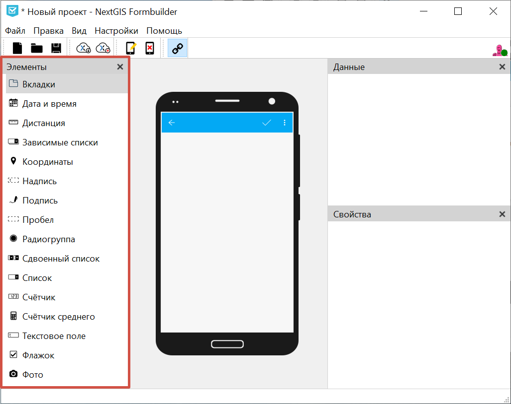

   Панель элементов

Чтобы *добавить элемент* на форму - начните перетаскивать его курсором с зажатой левой кнопкой мыши на экран устройства - курсор примет форму сжатой руки. Альтернативно можно быстро добавить элемент в конец формы один раз щёлкнув по нему левой кнопкой мыши с зажатой клавишей клавиатуры Ctrl.

.. note::
    Некоторые элементы могут быть недоступны, о чём свидетельствует иконка в виде замка на том или ином элементе. Для того чтобы получить полный доступ ко всем функциям программы - пройдите авторизацию, и при наличии подписки функциональность станет доступной.

Элементы, доступные без авторизации: дата и время, надпись, пробел, радиогруппа, список, текстовое поле, флажок.

Элементы, доступные только в версии Pro: вкладки, дистанция, зависимые списки, координаты, подпись, сдвоенный список, счетчик, счетчик среднего, фото.

.. _ngfb_controls_tabs:

Вкладки
-------

Вкладки используются для группирования других элементов. Можно добавлять в форму несколько комплектов вкладок одновременно и регулировать количество вкладок в каждом комплекте.

Форма может одновременно содержать элементы вне вкладок и распределенные по вкладкам.

Чтобы добавить комплект вкладок, перетащите элемент "Вкладки" в форму. Справа в панели "Свойства" появятся свойства этого комплекта. 

С помощью этой панели можно **переключаться между вкладками** внутри комплекта, а также вызвать диалог настроек вкладок.

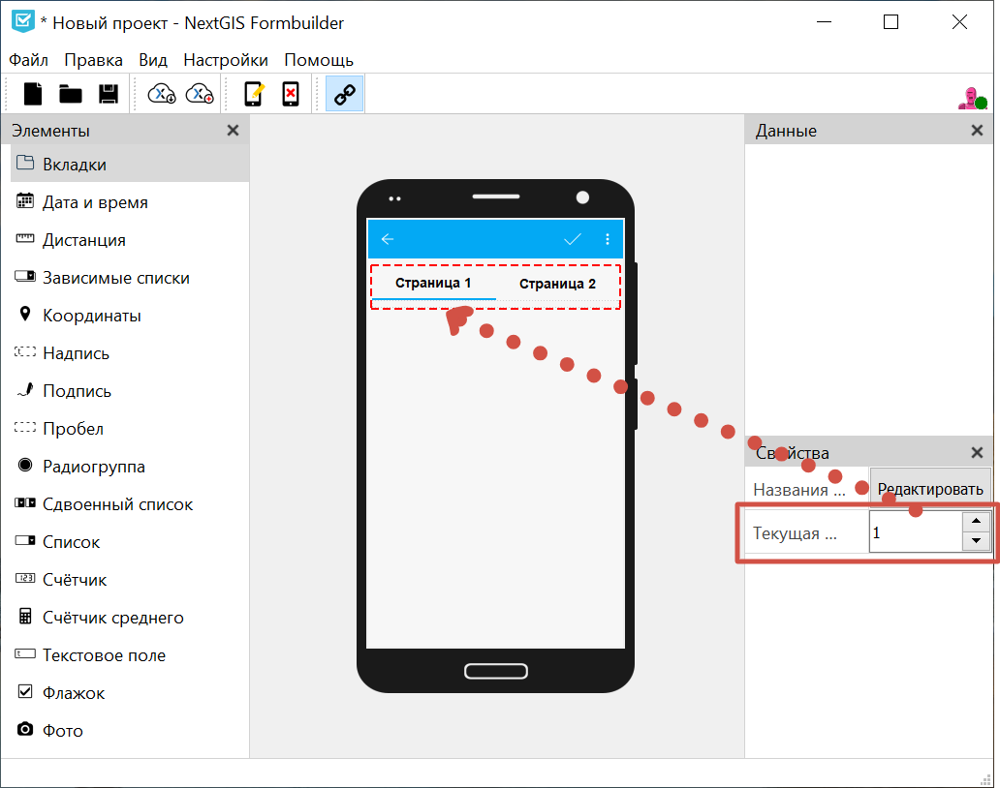

   Поле переключения между вкладками. Текущая вкладка 1 подчеркнута голубым в форме

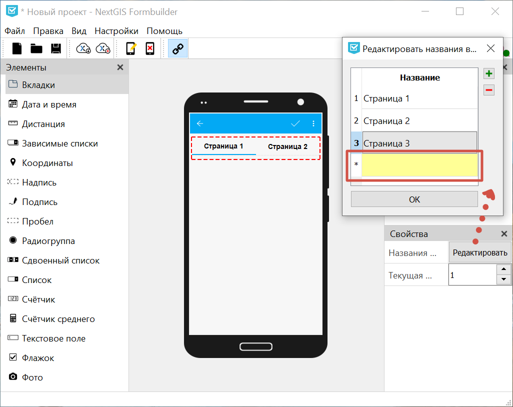

   Редактирование комплекта вкладок

Окно редактирования позволяет:

* Изменять названия вкладок (по умолчанию "Страница" + номер);
* Добавлять новые вкладки в набор (для этого впишите новое название в желтое поле в конце);
* Удалять вкладки.

.. _ngfb_controls_add_to_tab:

Добавление элементов во вкладки
~~~~~~~~~~~~~~~~~~~~~~~~~~~~~~~~~

Чтобы добавить элемент во вкладку, перетащите его. Элемент добавится в ту вкладку, которая в настоящий момент активна (выделена синим). Следите затем, чтобы новый элемент был размещен внутри элемента блока вкладок. Границы элемента показаны красным пунктиром, если нажать на блок вкладок.

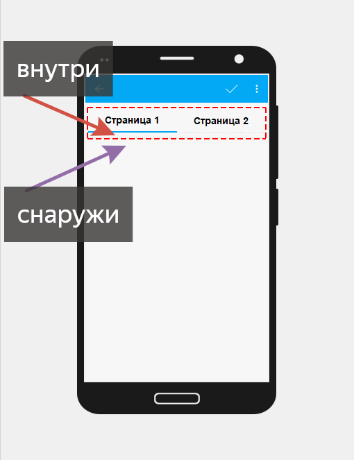

   Добавление элемента формы внутрь вкладки и снаружи

В одной форме может быть несколько блоков вкладок, а также элементы, расположенные вне вкладок.

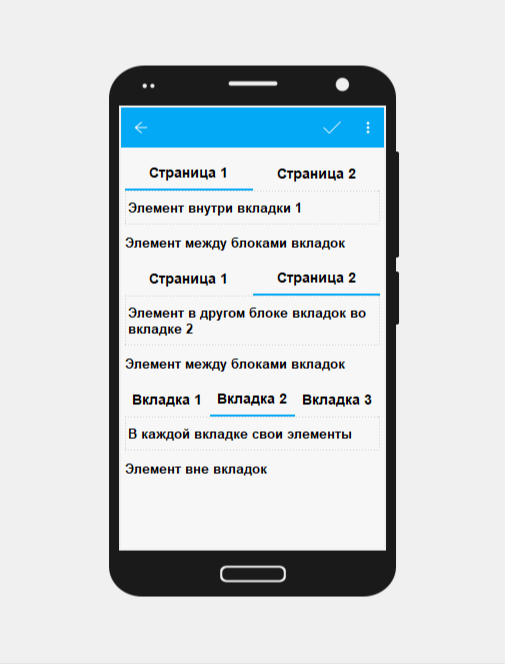

   Возможные способы размещения элементов и вкладок.

Элементы, расположенные в неактивной вкладке, скрываются. Чтобы редактировать их, переключитесь на нужную вкладку в панели "Свойства".

При удалении блока вкладок будут удалены также все элементы, находящиеся внутри каждой из вкладок. Чтобы избежать случайного удаления, программа запросит подтверждение.

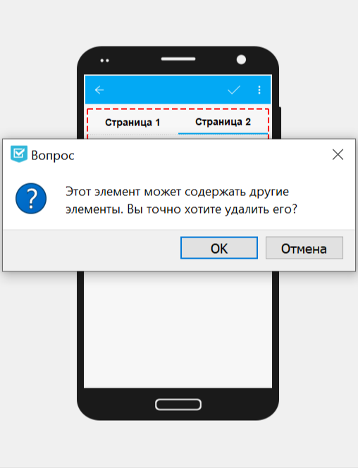

   Диалог подтверждения удаления блока вкладок

.. _ngfb_controls_datetime:

Дата и время
------------

Элемент, позволяющий выбрать дату, время или дату + время.

Свойства:

* **Запоминать значение**. Сохранять ли введённое ранее значение в этом элементе.
* **Исходное значение**. Можно задать значение поля по умолчанию, чтобы сборщик менял его только при необходимости.
* **Текущая дата/время**. При включенной опции элемент автоматически сохраняет текущую дату/время на момент сбора данных. Если не задать эту опцию, сборщик данных будет выбирать дату/время вручную.
* **Тип**. Дата, время или дата + время.

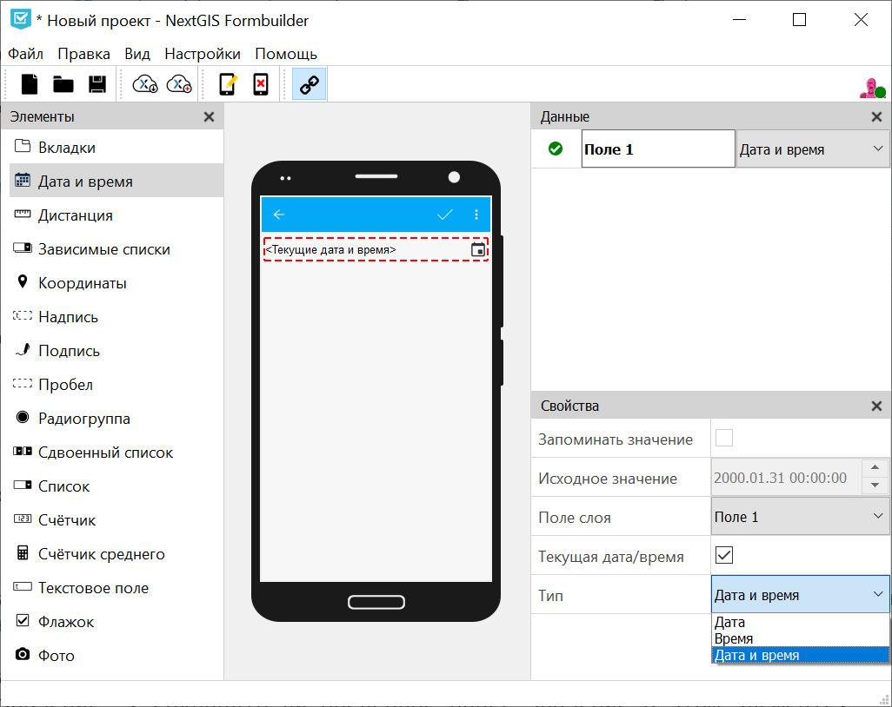

   Элемент "Дата и время" и его свойства

.. _ngfb_controls_distance:

Дистанция
---------

Элемент, автоматически измеряющий расстояние между сборщиком данных и указанной точкой.

.. _ngfb_controls_coordinates:

Координаты
----------

Элемент, автоматически сохраняющий текущее местоположение сборщика данных в текстовом формате.

Содержит два поля: долгота и широта.

Свойства элемента:

* **Поля** можно поменять местами при необходимости, выбрав из выпадающего списка нужный номер поля.
* **Скрыть**. Элемент не будет показан в форме, но координаты будут всё равно сохраняться.

* **Система координат**. Отображает систему координат, в которой собираются данные (ESPG:4326).
* **Формат**. Формат, в котором будут сохранены координаты (десятичные градусы).

.. _ngfb_controls_label:

Надпись
-------

Элемент, отображающий текст. 

Свойства:

* **Текст**. Можно отредактировать отображаемый текст.

.. _ngfb_controls_sign:

Подпись
-------

Поле для подписи.

.. _ngfb_controls_void:

Пробел
------

Пустое пространство для создания отступов.

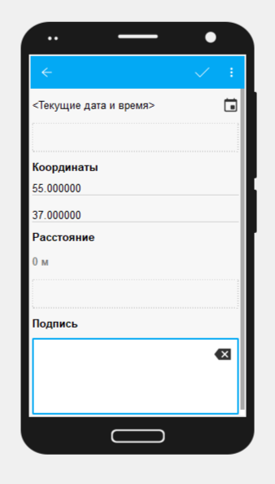

   Форма с отступами

.. _ngfb_controls_radio:

Радиогруппа
-----------

Список значений (сборщик данных может выбрать только одно значение).

Свойства:

* **Запоминать значение**. Сохранять ли введённое ранее значение в этом элементе.
* **Значения**. Нажав **Редактировать**, вы можете изменять список значений (должно быть как минимум два значения). 
* **Поле слоя**. Позволяет выбрать, в какое поле слоя будут сохраняться данные из этого элемента формы.

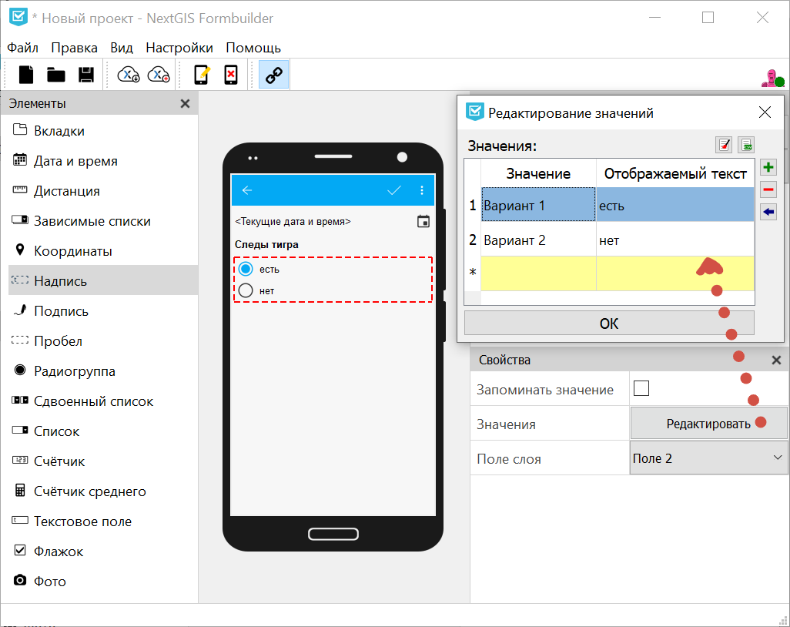

   Редактирование радиогруппы

При редактировании значений доступны следующие действия:

* Добавить новое значение (впишите его в желтую строку со звездочкой вместо номера и нажмите Enter или кнопку с плюсом)
* Очистить таблицу значений
* Загрузить таблицу значений из файла CSV
* Добавить значения из последней строки для ввода - сохраняет введенное в желтую строку значение и добавляет новую строку для ввода
* Удалить выбранную строку
* Задать значение по умолчанию

Чтобы загрузить значения из файла, нажмите на кнопку |button_load_csv| с зеленой меткой над списком. Обратите внимание, что ранее введенные значения будут при этом заменены на значения из списка, об этом появится предупреждение.

Выберите на устройстве файл CSV, из которого хотите добавить список. Список должен содержать от 2 до 16 строк.

В следующем окне выберите столбцы для значения и соответствующего ему отображаемого текста. Таблица этих соответствий появится в окне редактирования. После сохранения добавленный список будет отображен в форме.

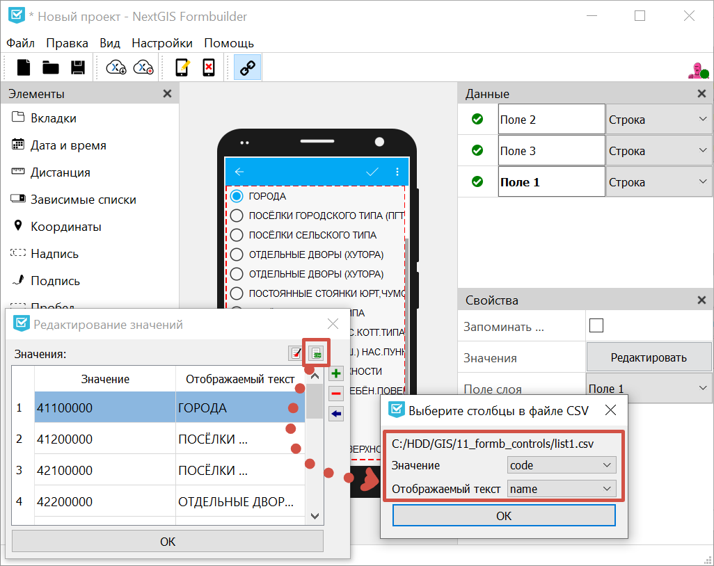

   Загрузка значений из файла CSV

Чтобы очистить таблицу значений и ввести новые вручную, нажмите на кнопку |button_clear_csv| с красной метелкой над списком. 

.. _ngfb_controls_combobox:

Список
------

Выпадающий список значений (сборщик данных может выбрать только одно значение).

Свойства:

* **Ввод с поиском**. Во время набора текста в списке будут отображаться доступные варианты.
* **Запоминать значение**. Сохранять ли введённое ранее значение в этом элементе.
* **Значения**. Список значений.
* **Поле слоя**. Позволяет выбрать, в какое поле слоя будут сохраняться данные из этого элемента формы.
* **Свои значения**. Сборщик данных может добавлять свои значения в список.

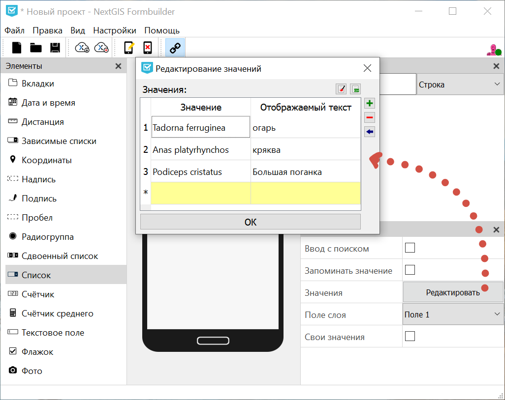

   Редактирование значений списка

При редактировании значений доступны следующие действия:

* Добавить новое значение (впишите его в желтую строку со звездочкой вместо номера и нажмите Enter или кнопку с плюсом)
* Очистить таблицу значений
* Загрузить таблицу значений из файла CSV
* Добавить значения из последней строки для ввода - сохраняет введенное в желтую строку значение и добавляет новую строку для ввода
* Удалить выбранную строку
* Задать значение по умолчанию

Чтобы загрузить значения из файла, нажмите на кнопку |button_load_csv| с зеленой меткой над списком. Обратите внимание, что ранее введенные значения будут при этом заменены на значения из списка, об этом появится предупреждение.

Выберите на устройстве файл CSV, из которого хотите добавить список. Список должен содержать от 2 до 65536 строк.

В следующем окне выберите столбцы для значения и соответствующего ему отображаемого текста. Таблица этих соответствий появится в окне редактирования. После сохранения добавленный список будет отображен в форме.

.. _ngfb_controls_split_cb:

Сдвоенный список
----------------

Выпадающий список, значения которого разбиты на две части. Пример использования: сборщик данных сможет увидеть одно и то же название объекта на двух языках.

Свойства:

* **Заголовок (слева)**. Текст над левым списком.
* **Заголовок (справа)**. Текст над правым списком.
* **Запоминать значение**. Сохранять ли введённое ранее значение в этом элементе.
* **Значения**. Список значений, нажмите **Редактировать**, чтобы ввести нужные значения.

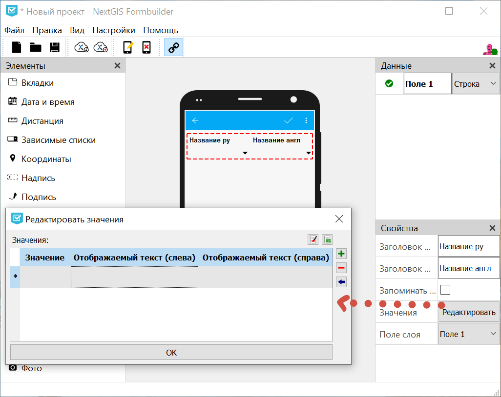

   Редактирование значений сдвоенного списка

.. _ngfb_controls_dependet_cb:

Зависимые списки
----------------

Пара выпадающих списков. Значения зависимого списка (нижний) зависят от выбранного значения основного списка (верхний).

**Пример использования:**

* Основной список - перечень регионов (1. Приморский край; 2. Хабаровский край)
* Зависимый список - районы в этих регионах (1.1. Лазовский, 1.2. Хорольский; 2.1. Тугуро-Чумиканский, 2.2. Верхнебуреинский)

Свойства:

* **Значения**. Список значений.
* **Запоминать значение**. Сохранять ли введённое ранее значение в этом элементе.

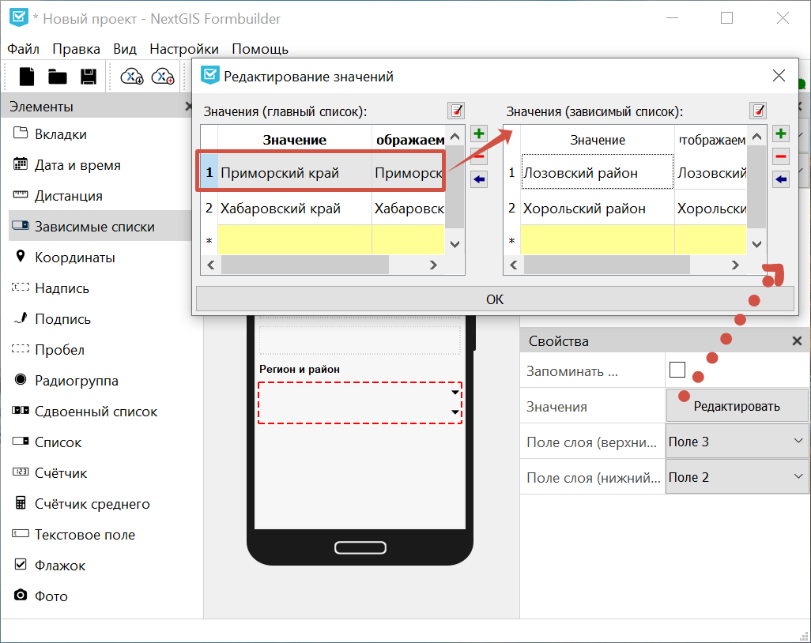

   Редактирование зависимого списка

.. _ngfb_controls_counter:

Счётчик
-------

Элемент который ведёт счёт собираемым объектам. Он автоматически добавляет значения в заданном формате.

Свойства:

* **Инкремент**. Значение, которое добавляется к текущему значению счётчика каждый раз когда сборщик данных собирает информацию об объекте. Задается целым числом от 1 до 999999999.
* **Исходное значение**. Начальное значение, с которого начинается счёт. Задается целым числом от 0 до 999999999.
* **Поле слоя**. Позволяет выбрать, в какое поле слоя будут сохраняться данные из этого элемента формы.
* **Префикс**. Текст, добавляемый перед значением счётчика в момент сохранения. Если префикс или суффикс не пустой, поле автоматически сохраняется как строка. Если они пустые, можно установить другой тип поля. Префикс можно вписать в поле вручную или воспользоваться следующим свойством **Префикс из списка** и добавить список, из которого будет выбираться один из вариантов. 
* **Суффикс**. Текст, добавляемый после значения счётчика в момент сохранения. Если префикс или суффикс не пустой, поле автоматически сохраняется как строка. Если они пустые, можно установить другой тип поля. Можно ввести вручную или выбрать **Суффикс из списка**.

Чтобы добавить список префиксов или суффиксов, в верхней панели откройте меню "Правка" и выберите "Редактировать префиксы". Каждая колонка представляет собой отдельный список.

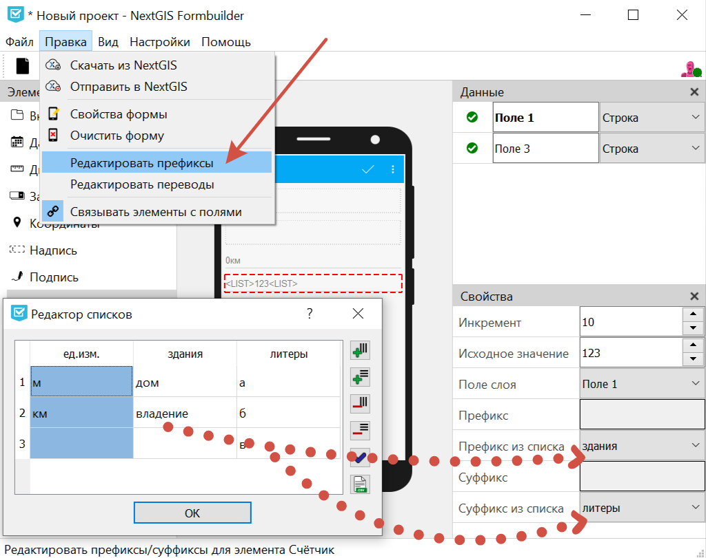

   Списки префиксов и суффиксов

.. _ngfb_controls_average:

Счётчик среднего
----------------

Элемент, вычисляющий среднее значение от введённых значений. Содержит интерактивный элемент, кнопку "Посчитать".

Свойства:

* **Количество значений**. Сколько значений сборщик данных должен внести, для того чтобы посчиталось среднее значение.
* **Поле слоя**. Позволяет выбрать, в какое поле слоя будут сохраняться данные из этого элемента формы.

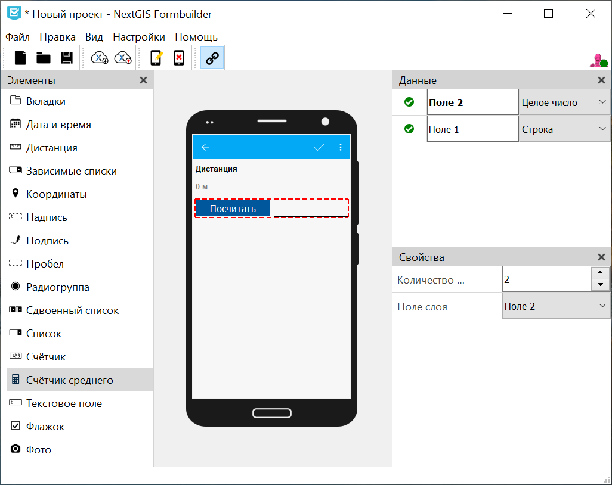

   Элемент "Счетчик среднего"

.. _ngfb_controls_text:

Текстовое поле
--------------

Элемент для редактирования текста или чисел.

Свойства:

* **Исходный текст**. Исходный текст, отображающийся в поле.
* **Запоминать значение**. Сохранять ли введённое ранее значение в этом элементе.
* **Макс. число строк**. Максимальное число строк для данного текстового поля. Целое число в диапазоне между 1 и 256.
* **Логин NextGIS ID**. Это текстовое поле будет сохранять логин NextGIS ID под которым авторизовался сборщик данных в процессе сбора данных. При выборе этой опции другие свойства элемента, кроме выбора поля, становятся недоступны.
* **Логин NextGIS Web**. Это текстовое поле будет сохранять логин NextGIS Web под которым авторизовался сборщик данных в процессе сбора данных. При выборе этой опции другие свойства элемента, кроме выбора поля, становятся недоступны.
* **Поле слоя**. Позволяет выбрать, в какое поле слоя будут сохраняться данные из этого элемента формы.
* **Только цифры**. Через этот элемент можно будет вводить только числа.

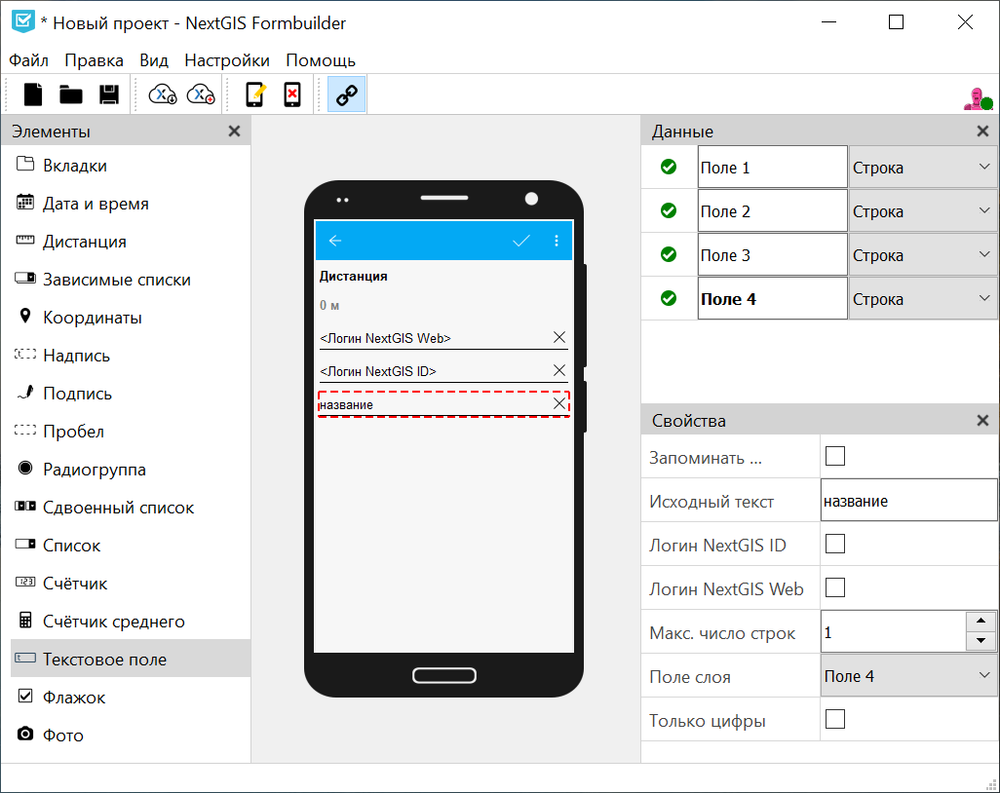

   Три текстовых поля в форме: логин NextGIS ID, логин NextGIS Web и обычный текст

.. _ngfb_controls_checkbox:

Флажок
------

Элемент, который позволяет сборщику данных выбирать одно из двух значений: истина или ложь.

Свойства:

* **Запоминать значение**. Сохранять ли введённое ранее значение в этом элементе.
* **Исходное значение**. Исходное значение: если поставить галочку в этом свойстве, то по умолчанию она будет стоять в форме.
* **Текст**. Отображаемый текст.

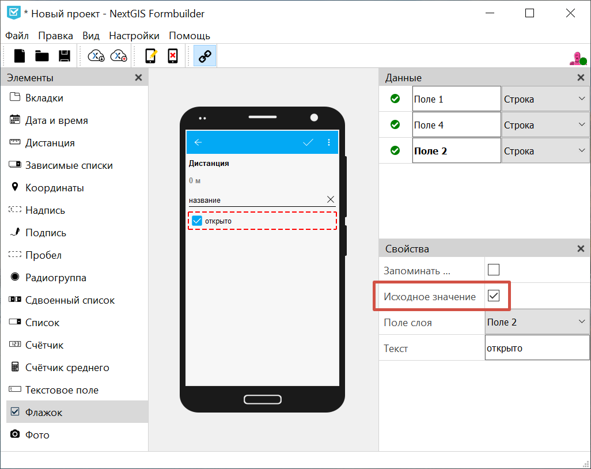

   Флажок с установленным значением по умолчанию "истина"

.. _ngfb_controls_photo:

Фото
----

Элемент, позволяющий сборщику данных делать фотографии или выбирать их из галерии.

Свойства:

* **Макс. число фото**. Максимальное число фото. Диапазон от 1 до 20.
* **Комментарий**. Комментарий под фотографиями.
