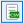

.. sectionauthor:: Mikhail Gusev <mikhail.gusev@nextgis.ru>, Yulia Grigorenko <grigorenko.j@gmail.com>

.. _ngfb_controls:

Form elements
==============

This toolbar contains elements that can be added to a form. Hover over an element to see tooltip with its description.

To *add an element* to a form drag it holding left mouse button onto the device screen in the middle (the pointer will look like a squeezed hand). Alternatively you can quickly add an element to the end of the form by left-click + Ctrl.

.. note::
    Some elements may be inaccessible, they are marked by a lock sign. To get access to the full functionality, log in and make sure you have a corresponding subscription plan.

Elements available without logging in: date & time, combobox, checkbox, label, radiogroup, text edit, void space.

Elements only available in Pro version: average counter, coordinates, counter, dependent comboboxes, distance meter, photo, signature field, split combobox, tabs.

.. _ngfb_controls_tabs:

Tabs
-------

Tabs are used to group other elements. You can add multiple tab sets to a form and manage the number of tabs in each of them.

In a form, some elements can be in tabs while others are outside tab sets.

To add a tab set, drag "Tabs" element to the form. On the right is the Properties panel of the tab set. 

In this panel you can **switch between tabs** of the set and open the tab modifying dialog.

In the Modify dialog you can:

* Change tab headers (default names are "Tab"+№)
* Add new tabs to the set (enter a name for the new tab to the yellow field at the bottom)
* Delete tabs

.. _ngfb_controls_add_to_tab:

Adding elements to tabs
~~~~~~~~~~~~~~~~~~~~~~~~~~~~~~~~~

To add an element to a tab, drag it to it. The element will be added to the active tab marked in blue. Make sure that the element is within the tab set. To see the tab set edges (red dashed line) click on the set.

   Adding elements to a tab and outside the tab set

A form can have multiple tab sets as well as elements outside sets.

   Possible placement of elements and tabs.

Elements placed in the tab that is not currently active are hidden. To edit them, switch to that tab using Properties panel.

If a tab set is deleted, all elements of each tab will also be deleted. To avoid accidental deleting, a confirmation dialog will appear.

   Confirmation dialog for deleting a tab set

.. _ngfb_controls_datetime:

Date and time
------------

This elements allows to enter date, time or date+time.

Properties:

* **Keep last value**. The default value will be the last entered.
* **Initial value**. You can set a default value so that collector changes it only if necessary.
* **Current**. If checked, the element will automatically save the date and time of data collection. If unchecked, collector enters date and time manually.
* **Type**. Date; time; or date + time.

.. _ngfb_controls_distance:

Distance meter
---------

This element automatically measures distance between data collector and the entered point.

.. _ngfb_controls_coordinates:

Coordinates
----------

This element automatically saves current position of the data collector in string format.

Contains two fields: latitude and longitude.

Properties:

* **Fields** can be interchanged. Choose the field number from the dropdown menu.
* **Hide**. The element will not be visible in the form, but the coordinates will be saved anyway.

* **CRS**. Displays Coordinate reference system used for data collection (ESPG:4326).
* **Format**. Displays coordinate format (decimal degrees).

.. _ngfb_controls_label:

Label
-------

This element allows adding text labels to the form. 

Properties:

* **Text**. Edit the text visible in the form.

.. _ngfb_controls_sign:

Signature field
-------

Field for a signature

.. _ngfb_controls_void:

Void space
------

An empty field to create spaces between elements.

.. figure:: _static/fb_with_voids_en.png
   :name: fb_with_voids_pic
   :align: center
   :width: 10cm

   Form with void spaces

.. _ngfb_controls_radio:

Radiogroup
-----------

A list of predetermined values (data collector chooses only one item from the list).

Properties:

* **Keep last value**. The default value will be the last entered.
* **Items**. Press **Modify** to edit the list (it must contain at least two items). 
* **Field**. Select the layer field to store the data from this element.

Modifying radiogroup allows to make following changes:

* Add new item (enter it into the yellow row with "*" for number and press Enter or "+" button on the right)
* Clear list of items
* Load items from .csv file
* Add items from the last row - saves value entered in the yellow field and creates a new empty row for value entering
* Remove selected row
* Set as default value

To load a list from a file, press |button_load_csv| button with green mark above the table. Keep in mind that the current items will be cleared and replaced with items from the CSV file, a warning will appear before loading.

Select CSV file with the list on your device. The list must contain 2 to 16 rows.

In the next dialog select the columns for the value and the corresponding display text. A list form from these two columns will appear in the table. Save the list by pressing **Ok**. It will appear in the form.

To clear the list and enter new items manually, press |button_clear_csv| button with red broom on it above the table. 

.. _ngfb_controls_combobox:

Combobox
------

A dropdown menu to select one value from a predetermined list.

Properties:

* **Input with search**. User can start typing to find available items.
* **Keep last value**. The default value will be the last entered.
* **Items**. Here you can edit the list of possible values.
* **Field**. Select the layer field to store the data from this element.
* **Custom items**. Data collector can enter new items to the list.

Modifying combobox allows to make following changes:

* Add new item (enter it into the yellow row with "*" for number and press Enter or "+" button on the right)
* Clear list of items
* Load items from .csv file
* Add items from the last row - saves value entered in the yellow field and creates a new empty row for value entering
* Remove selected row
* Set as default value

To load a list from a file, press |button_load_csv| button with green mark above the table. Keep in mind that the current items will be cleared and replaced with items from the CSV file, a warning will appear before loading.

Select CSV file with the list on your device. The list must contain 2 to 65536 rows.

In the next dialog select the columns for the value and the corresponding display text. A list form from these two columns will appear in the table. Save the list by pressing **Ok**. It will appear in the form.

To clear the list and enter new items manually, press |button_clear_csv| button with red broom on it above the table. 

.. _ngfb_controls_split_cb:

Split combobox
----------------

Dropdown list with predetermined items split into two parts. For instance, showing a place name in two different languages.

Properties:

* **Caption (left)**. Text displayed above the left list.
* **Caption (right)**. Text displayed above the right list.
* **Keep last value**. The default value will be the last entered.
* **Items**. Press **Modify** to edit the list.

.. _ngfb_controls_dependet_cb:

Dependent comboboxes
----------------

A pair of drop-down lists with predefined items.  The item list of the dependent combobox (bottom) depends on the items of the main combobox (top).

**Example:**

* Main list - a list of regions (1. Centre-Val de Loire; 2.  Grand Est)
* Dependent list - departments of the regions (1.1. Eure-et-Loir, 1.2. Indre; 2.1. Ardennes, 2.2. Marne)

Properties:

* **Items**. Here you can edit the list of possible values.
* **Keep last value**. The default value will be the last entered.

.. _ngfb_controls_counter:

Counter
-------

An element which automatically adds values based on some predefined format. 

Properties:

* **Increment**. The value which is added to the current counter’s value each time user collects data about an object. Integer, 1 to 999999999.
* **Initial value**. Initial value from which the counter starts. Integer, 0 to 999999999.
* **Field**. Select the layer field to store the data from this element.
* **Prefix**. Text added before the counter’s value. If this text is not void the counter writes its value as a string. If it is void, the field type can be modified. You can enter the value manually or use **Prefix from list** and add a predetermined list to select a prefixe from. 
* **Suffix**. A text which is added after the counter’s value. If this text is not void the counter writes its value as a string. If it is void, the field type can be modified. You can also use **Suffix from list**.

To create a list of prefixes or suffixes, in the top panel open the Edit menu and select "Edit prefixes". Each column is a separate list.

.. _ngfb_controls_average:

Average counter
----------------

An element which calculates the average value from some amount of entered values. Includes an interactive **Count** button.

Properties:

* **Number of values**. How many values data collector should enter to calculate an average value.
* **Field**. Select the layer field to store the data from this element.

.. _ngfb_controls_text:

Text edit
--------------

An element for editing simple text or numbers.

Properties:

* **Initial text**. The text displayed in the field by default.
* **Keep last value**. The default value will be the last entered.
* **Max. lines count**. Maximum number of lines for this text edit field. Integer, 1 to 256.
* **NextGIS ID login**. This field will automatically store NextGIS ID used by the data collector to log in. If you select this option, other properties except field selection are unavailable.
* **NextGIS Web login**. This field will automatically store NextGIS Web login used by the data collector to log in. If you select this option, other properties except field selection are unavailable.
* **Field**. Select the layer field to store the data from this element.
* **Only numbers**. If checked, this element can only accept numbers.

.. _ngfb_controls_checkbox:

Checkbox
------

An element which allows user to pick from two values: true or false.

Properties:

* **Keep last value**. The default value will be the last entered.
* **Initial value**. If this property is checked, the default value of the checkbox is "true".
* **Text**. Display text.

.. _ngfb_controls_photo:

Photo
----

An element which allows to take photos with the camera of the device or to add them from the gallery.

Properties:

* **Max. photo count**. Maximum number of photos. Integer, 1 to 20.
* **Comment**. Comment under photo(s).
