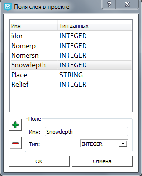

.. sectionauthor:: Михаил Гусев <mikhail.gusev@nextgis.ru>

.. _ngfb_features:

Возможности программы
=====================

.. _ngfb_new_form:

Создание нового проекта
-----------------------

Нажмите на одну из трёх первых кнопок верхнего меню в закладке "Проект" и в открышемся диалоге задайте начальные параметры нового проекта.

С нуля
^^^^^^

Этот способ можно выбрать, если у вас отсутствует исходный слой и/или вы хотите сами определить состав и структуру полей слоя с самого начала. В открывшемся диалоге (кнопка "Новый с нуля") выберите геометрию будущего слоя: 

* Точка; 
* Линия; 
* Полигон; 
* Мультиточка; 
* Мультилиния; 
* Мультиполигон. 

.. note::
    Слой для формы создастся автоматически при сохранении проекта. Созданный слой будет иметь систему координат WGS84. 

Из Esri Shapefile
^^^^^^^^^^^^^^^^^

Этот способ можно выбрать, если вы хотите производить сбор данных в локальный файл, причём с уже заранее заданными объектами. В открывшемся диалоге (кнопка "Новый проект из Shapefile") выберите исходный Shapefile.  

.. note::
    Данные из выбранного Shapefile-а будут скопированы в момент первого сохранения проекта. В момент копирования их геометрии (только первое поле) будут трансформированы в систему координат WGS84. После этого исходный Shapefile потеряет связь с проектом и данные при сборе будут заноситься в сохранившийся файл с расширением .ngfp.

Из подключения к NextGIS Web
^^^^^^^^^^^^^^^^^^^^^^^^^^^^

Этот способ можно выбрать, если вы хотите производить сбор данных в "удалённый слой" на вашей Web GIS. В открывшемся диалоге (кнопка "Новый из NextGIS Web") задайте настройки для подключения к NextGIS Web: исходный URL (например http://demo.nextgis.com), логин и пароль, после чего нажмите кнопку "Соединить". Если соединение было успешным, то дерево доступных ресурсов будет выведено в контейнер ниже. Раскрывайте каждый из ресурсов для просмотра его подресурсов и, выбрав итоговый, нажмите кнопку "Выбрать". Поддерживаются только векторные ресурсы. 

.. note::
    Удостоверьтесь, что вы работаете с учётной записью с правами администратора. В противном случае данные не смогут отправиться на сервер. 

.. note::
    В итоговом .ngfp файле будут сохранены настройки подключения, в т.ч. и пароль. В настройках приложения так же будут храниться настройки последнего успешного подключения, но за исключением пароля.
    
.. note::
    Изменить структуру выбранного слоя будет уже нельзя, в отличие от случаев, когда вы создаёте проект другими способами.

.. _ngfb_save_form:

Сохранение проекта
------------------

Нажмите на кнопку с изображением дискеты "Сохранить как" или "Сохранить" верхнего меню в закладке "Проект". В первом случае будет предложено выбрать путь и имя для записи или перезаписи итогового .ngfp файла, а во втором - сохранение произойдёт в открытый в данный момент .ngfp проект сразу же.

.. note::
    Все данные слоя в .ngfp файле пересохраняются каждый раз при вызове "Сохранить" или "Сохранить как", что вызвано особенностью zip-формата файла.

.. _ngfb_clear_form:

Очистка формы
-------------

Удалить все элементы формы можно при помощи инструмента "Очистить экран" в закладке "Форма" верхнего меню. Каждый элемент в отдельности можно удалить при помощи инструмента "Удалить элемент" или клавишей **delete**.

.. note::
    Удаление элементов нельзя отменить.

.. _ngfb_import_controls:

Импорт элементов
----------------

Элементы формы так же можно импортировать из уже существующей формы. Для этого в закладке "Форма" верхнего меню нажмите на инструмент "Импортировать элементы формы" и в появившемся диалоге выберите файл с расширением .ngfp. После чего форма полностью обновится элементами из этого файла.

.. note::
    Процедура импорта элементов полностью удалит все элементы, имевшиеся на форме до этого. Данное действие нельзя отменить. 

.. _ngfb_field_manager:

Менеджер полей
--------------

Список полей слоя можно изменять в любой момент работы с программой. Для этого используйте инструмент "Менеджер полей" в закладке "Данные" верхнего меню, окно которого представлено на :numref:`ngfb_fields_dialog_pic`. 

   
   Диалог редактирования полей слоя проекта.

Добавляйте новые поля при помощи кнопки "+", предварительно введя их имя и выбрав тип данных. Имена полей должны быть уникальны. Для уже существующего поля изменить его тип нельзя. Удалять поля можно при помощи кнопки "-", предварительно выбрав их в списке. 

.. note::
    Важно, что если удалить существующее поле слоя, то все соответствующие этому полю данные будут удалены (даже если после этого добавить новое поле с таким же именем), о чём предупредит всплывающее сообщение. 

.. note::
    Реальное изменение состава полей в слое и соответствующие удаления (если они были инициированы) произойдут в момент сохранения проекта. 

.. _ngfb_update_data:

Обновление данных слоя
----------------------

Для обновления данных слоя нажмите на инструмент "Обновить данные слоя" в закладке "Данные" верхнего меню. В появившемся диалоге выберите Shapefile, данные из которого должны быть "затянуты" в слой проекта для замены старых данных. Если структура полей выбранного Shapefile-а совпадает со структурой полей текущего слоя, то сохранение данных в ngfp-файл текущего проекта произойдёт сразу же, иначе будет выдано сообщение об ошибке.

.. _ngfb_to_web:

Создание слоя в NextGIS Web
---------------------------

Если вы хотите быстро и удобно создать слой в вашей Web GIS, нажмите на кнопку "Web" закладки "Данные" верхнего меню. Структура и геометрия нового слоя будет взята из текущего проекта (она могла быть определена любым способом), вам нужно будет только определить имя слоя и группу ресурсов (если необходимо). Если создание слоя прошло успешно, вам будет предложено создать новый проект на его основе с полным копированием текущей формы, хотя это всегда можно сделать отдельно. 

.. note::
    Удостоверьтесь, что вы работаете с учётной записью с правами администратора. В противном случае у вас не получится создать слой или отправить данные в этот слой при сборе.
    
